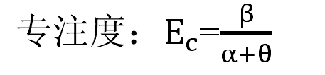
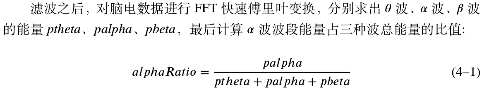
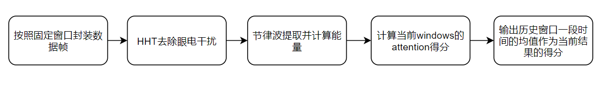
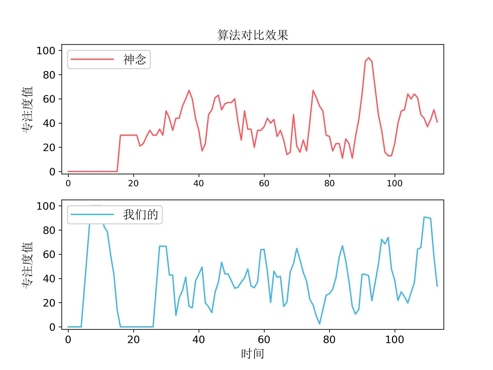

# 脑电专注度&放松度检测

## 1. 理论依据

### 专注度

目前，应用最广泛的评价专注度方法是Pope等于1995年提出的根据alpha,beta，theta频段能量计算认知专注度的公式(Pope et al., 1995)。
即beta频段能量与alpha和theta频段能量之和的比值，根据现今对脑电信号的理解，这是因为人们在注意力集中或者警觉的情况下脑电信号主要表现为beta频段的信号，
而人们在静息态或者睡眠时主要表现为alpha或者theta甚至更低频率频段的信号，因此这个比值可以表征人们注意力专注程度[1]。

[1] 李翀.基于机器人辅助神经康复的患者训练参与度与专注度研究.2017.清华大学,PhD dissertation.

### 放松度
许多研究发现，𝛼波成分在放松时会增加，在有压力时会减小, 因此𝛼波的含量被认为可以作为平静放松程度的一个指标。而一般成年人脑电中𝛿波和𝛾波所占比例非常小[2]。

[2] 吴轶. 基于脑电的多模态情绪放松系统的实现与研究[D].上海交通大学,2020.

## 2. 算法pipeline

## 3. 接口

#### HHTFilter(eegRaw, componentsRetain)
    滤波，去除眼电干扰
    :param eegRaw: 分帧后的数据      
    :param componentsRetain: 需要保留的信号成分     
    :return: 去除眼电后的干净数据

#### get_attention_score(oneframe, fs)
    获得当前帧的瞬时专注度
    :param oneframe: 一帧脑电数据
    :param fs: 信号采样率
    :return: 当前专注度得分

#### smooth_atten_score(attention_cache, observe_window, frame_window):
    attention得分平滑处理
    :param attention_cache: 历史attention得分
    :param observe_window: smooth时间窗口大小
    :param frame_window: 分帧的窗口大小
    :return: 输出有效attention得分

#### get_rhythm_features(oneframe, fs):
    提取信号节律波特征值
    :param oneframe: eeg信号
    :param fs: 采样频率
    :return: 特征值集合

#### get_meditation_score(features):
    获得当前帧的瞬时放松度
    :param oneframe: 一帧脑电数据
    :param fs: 信号采样率
    :return: 当前放松度得分

# 更新日志
* 2021.12.8 小包返回8个节律波能量值，移植看featureExtraction.py的get_attention_score get_meditation_score get_rhythm_features_fft三个接口   
  
* 2021.9.27 更新attention pipeline,引入小波求能量（fix_attention.py和featureExtraction.py）

# 结果对比
